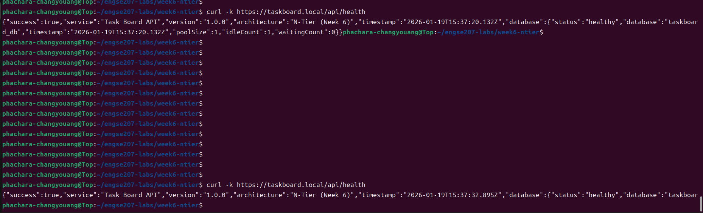

# 📋 Task Board - N-Tier Architecture (Week 6)

## 🏗️ Architecture
Browser → Nginx (HTTPS) → Node.js (API) → PostgreSQL (Data)

---

## 🚀 Quick Start

```bash
# Start all services
./scripts/start-all.sh

# Access URLs
# HTTPS via Nginx
https://taskboard.local
# Direct Node.js API
http://localhost:3000/api/health
```

---

## 📁 Project Structure

```
week6-ntier/
├── src/           # Backend source code (Node.js/Express)
├── public/        # Frontend files
├── database/      # SQL scripts & DB migration
├── nginx/         # Nginx configuration
├── docs/          # Documentation & screenshots
│   └── screenshots/
├── scripts/       # Helper scripts (start-all.sh, test-api.sh)
├── package.json
├── package-lock.json
├── server.js
├── README.md
└── .env           # Environment variables
```

---

## 🛠️ Technologies

| Tier        | Technology            |
|------------|----------------------|
| Web Server | Nginx                 |
| Backend    | Node.js + Express     |
| Database   | PostgreSQL            |

---

## 📝 Setup Instructions

### 1️⃣ PostgreSQL

```bash
# ตรวจสอบ service
sudo systemctl status postgresql

# ดู logs
sudo tail -50 /var/log/postgresql/postgresql-*-main.log

# Reset password ถ้าจำเป็น
sudo -u postgres psql -c "ALTER USER taskboard PASSWORD 'taskboard123';"
```

### 2️⃣ Nginx

```bash
# Test config
sudo nginx -t

# Restart Nginx
sudo systemctl restart nginx

# ดู logs
sudo tail -f /var/log/nginx/taskboard_error.log
```

### 3️⃣ Node.js Backend (PM2)

```bash
# Start backend
pm2 start server.js --name "taskboard-api" --watch

# Restart if needed
pm2 restart taskboard-api

# Logs
pm2 logs taskboard-api

# Check status
pm2 show taskboard-api
```

---

## 🧪 Testing

```bash
# Run API test suite
./scripts/test-api.sh
```

✅ Tests include:

- Health check
- CRUD operations (Create, Read, Update, Delete)
- Statistics endpoint
- HTTPS via Nginx

---

## 🔧 Environment Variables (`.env`)

```env
# Database Configuration
DB_HOST=localhost
DB_PORT=5432
DB_NAME=taskboard_db
DB_USER=taskboard
DB_PASSWORD=taskboard123

# Server Configuration
PORT=3000
NODE_ENV=development
```

---

## 📸 Screenshots

1. **Services Status (PostgreSQL, Nginx, PM2)**  
  


2. **HTTPS in Browser**  


3. **API Response (`curl -k https://taskboard.local/api/tasks`)**  


4. **Task Board UI Working**  


5. **Create/Edit Task**  


---

## 👨‍💻 Author

**Phachara Changyouang** - ENGSE207 Week 6

- GitHub: [https://github.com/PhacharaChangyouang/week6-ntier-taskboard](https://github.com/PhacharaChangyouang/week6-ntier-taskboard)

---

## ⚡ Notes / Troubleshooting

### PostgreSQL

- Check service: `sudo systemctl status postgresql`
- Connection failed: Reset password

### Nginx

- 502 Bad Gateway: check PM2 backend
- SSL errors: verify certificates
- Firewall: allow port 443

### Node.js

- PM2 process management
- Logs: `pm2 logs taskboard-api`
- Environment variables: `.env`

---

## 🎯 Best Practices Learned

1. Use HTTPS even in development  
2. Protect DB credentials using environment variables  
3. Use PM2 for process management  
4. Nginx serves static content better than Node.js  
5. Document configuration and project structure

---

## ✅ Self-Check Before Submit

- [x] PostgreSQL, Nginx, HTTPS running  
- [x] Backend API functional  
- [x] Frontend functional  
- [x] CRUD operations verified  
- [x] Screenshots included  
- [x] ANALYSIS.md completed  
- [x] README.md updated
